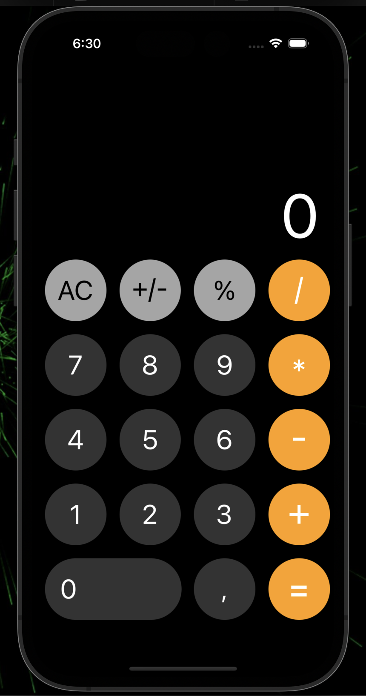

# Neobis_iOS_Calculating

This is a simple calculator app developed for iOS using Swift. The app provides basic arithmetic operations like addition, subtraction, multiplication, and division. It also includes percentage calculation, sign change, and the ability to clear the current input.

iOS Calculator
 

  

## Features

- Addition, subtraction, multiplication, and division operations.
- Calculation of percentages.
- Changing the sign of the displayed number.
- Clearing the current input.
- Responsive layout suitable for various iOS devices.

## Project Structure

The project consists of three main components: the calculator model, the calculator view, and the view controller.

### CalculatorModel.swift

This file defines the `CalculatorModel` struct, which holds the operands and the current operation for the calculations. It performs the selected operation and returns the result.

### CalculatorView.swift

The `CalculatorView` class represents the user interface of the calculator. It consists of various buttons for digits, operations, and special functions. The buttons are organized using stack views to maintain a clean layout. The view also includes a label to display the current input and result.

### CalculatorViewController.swift

The `CalculatorViewController` class is the main view controller that manages the interactions between the model and the view. It initializes the calculator model and handles user input through the calculator view. Based on the user's input, it updates the calculator model and displays the result in the view.

## Usage

1. Clone or download the project repository.
2. Open the project in Xcode.
3. Run the app on the iOS Simulator or a physical iOS device.
4. Use the buttons to input numbers and perform calculations.
5. Press the equal button (`=`) to see the result of the calculation.
6. Explore additional functionalities like percentage calculation and sign change.

## Acknowledgments

This calculator app was created by Askar Soronbekov as part of the Neobis iOS Calculating project.
